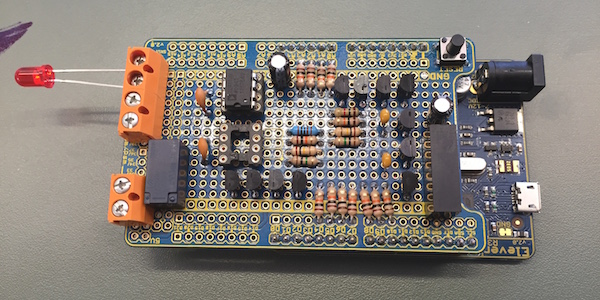
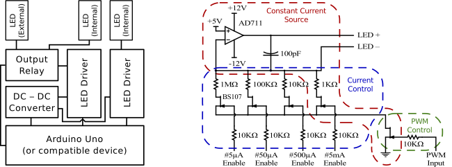

# star-simulator
Firmware for an arduino-based light source controller for simulating variable stars in a lightbox.
This forms the basis of an undergraduate laboratory experiment, and was originally designed for testing the Puoko-nui time series CCD photometer.

A paper on this device and the experiment designed around it is currently in preparation.

###### LED driver board

###### Hardware schematics

